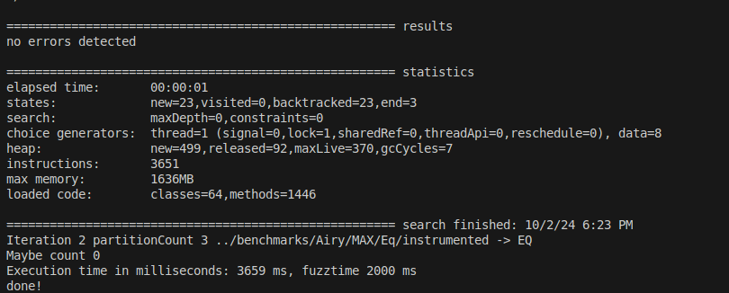
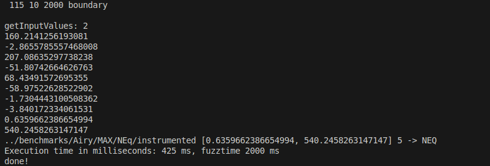

# HybridNonEqTesting

## Required java version
java version "1.8.0_202"

## Dependencies
</br> - JPF: JPF-Symbc, JPF-code are included in the project folders (the pre-guided-fuzzing one uses updated version for our approach)
</br> - Installation: 
1. mkdir ~/.jpf
2. Create site.properties
3.  Add in site.properties file ''jpf-core = /.../path-to-ARDiff_Equiv_Checking-folder/Implementation/jpf-git/jpf-core
          jpf-symbc = /.../path-to-ARDiff_Equiv_Checking-folder/Implementation/jpf-git/jpf-symbc
          extensions = ${jpf-core},${jpf-symbc} ''


## Baseline Symbolic Approaches
- ARDiff, DSE and IMP-S: https://github.com/resess/ARDiff.git
- PASDA: (SQLite database saving is removed and the clean version is saved in the PASDA folder) and the original one is in: https://zenodo.org/records/10033132


## Boundary and Uniform fuzzing
- Both are implemented and codes will be found inside the PreGuidedFuzz/Implementation/src/java/differencing/DifferencingRunner.java file
- a <fuzzType> and <fuzztime> parameters will be taken to choose the uniform and boundary fuzzing with defined time.

## Hybrid Approach
### Pre-Guided-Fuzz approach
- Pre-Guided-Fuzz approach is implemented inside the Pre-Guided-Fuzz appraoch folder 
- RunningBenchmarksCommonArDiff.sh will run Pre-Guided-fuzz approach on the programs: bash RunningBenchmarksCommonArDiff.sh 2000 boundary will run fuzzing for 2s with boundary fuzzing
- Abstraction of the compared methods: ``` timeout --verbose --foreground 115s java -jar '../Implementation/build/libs/ARDiff-base-1.0-SNAPSHOT-all.jar' --path1 ../benchmarks/Airy/MAX/Eq/oldV.java --path2 ../benchmarks/Airy/MAX/Eq/newV.java --tool H --s coral --b 10 --t 115 ```
- Product program generation, run pre-fuzz and guided-fuzz:  ``` timeout --verbose --foreground 115s java -jar '../Implementation/build/libs/ARDiff-diff-1.0-SNAPSHOT-all.jar' ../benchmarks/Airy/MAX/Eq Hybrid 115 10 2000 boundary ```

### Sample Result Format
 

### Post-Fuzz and Pre-Post-Fuzz thresholding
- Implemented in the Post-Threshold folder
- Threshold-based symbolic execution will be computed for post and pre-post fuzzing


